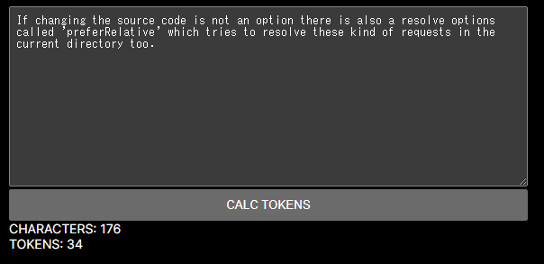

Small web app to calculate number of OpenAI's tokens.



This is a just a demo to calc tokens in Node.js. I recommend you to use the official tool.
https://platform.openai.com/tokenizer


`@dqbd/tiktoken` is used to calculate the tokens. In my tests, I got different results for a setence from the library and the official tool. So the number of tokens the library gives may differ from the tokens counted in OpenAI server.

e.g. Number of tokens of the following setences differs.
```
A helpful rule of thumb is that one token generally corresponds to ~4 characters of text for common English text. This translates to roughly ¾ of a word (so 100 tokens ~= 75 words).
```

@dqbd/tiktoken: 41
OpenAI Tokenizer: 40